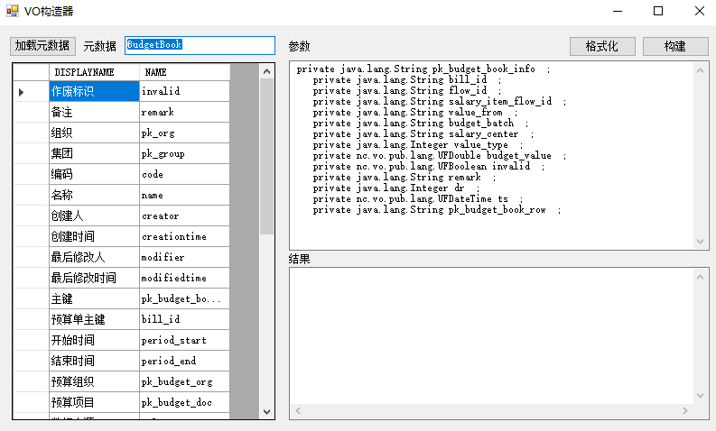
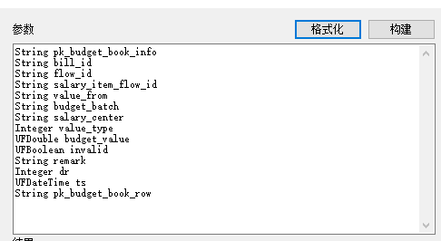
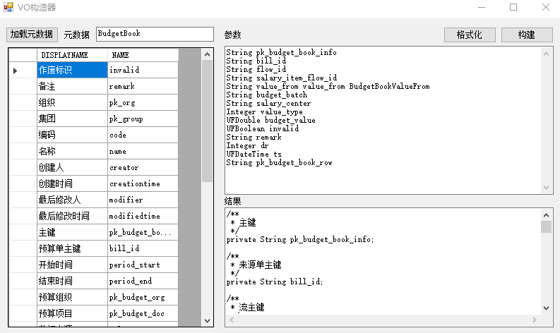
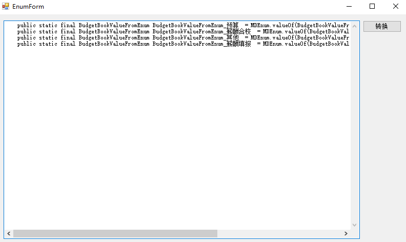

# NCToolsKidForJava
这是一个为NCC系统二开开发的辅助工具

## 第一次使用
第一次使用请配置数据库信息，数据库信息会保存于 ` ` 请注意信息安全。

## 功能介绍
### 1. 自动补丁整理器
### 2. 业务参数生成器
### 3. JavaBean生成器
### 4. TM的SQL里这个值到底对应那个字段
### 5. 多机合作助手

### 6. VO构造器
调整低代码平台生成的VO类代码. 讨厌下划线式命名规则专用
#### 示例:
1. 生成的代码如下：
``` java
import nc.vo.pub.*;
import nc.vo.pubapp.pattern.model.meta.entity.vo.VOMetaFactory;

public class BudgetBookRowInfoVO extends SuperVO {

	//构造方法
	public BudgetBookRowInfoVO() {
		super();
	}


    private java.lang.String pk_budget_book_info  ;
    private java.lang.String bill_id  ;
    private java.lang.String flow_id  ;
    private java.lang.String salary_item_flow_id  ;
    private java.lang.String value_from  ;
    private java.lang.String budget_batch  ;
    private java.lang.String salary_center  ;
    private java.lang.Integer value_type  ;
    private nc.vo.pub.lang.UFDouble budget_value  ;
    private nc.vo.pub.lang.UFBoolean invalid  ;
    private java.lang.String remark  ;
    private java.lang.Integer dr  ;
    private nc.vo.pub.lang.UFDateTime ts  ;
    private java.lang.String pk_budget_book_row  ;


	public static final String PK_BUDGET_BOOK_INFO = "pk_budget_book_info";
	public static final String BILL_ID = "bill_id";
	public static final String FLOW_ID = "flow_id";
	public static final String SALARY_ITEM_FLOW_ID = "salary_item_flow_id";
	public static final String VALUE_FROM = "value_from";
	public static final String BUDGET_BATCH = "budget_batch";
	public static final String SALARY_CENTER = "salary_center";
	public static final String VALUE_TYPE = "value_type";
	public static final String BUDGET_VALUE = "budget_value";
	public static final String INVALID = "invalid";
	public static final String REMARK = "remark";
	public static final String DR = "dr";
	public static final String TS = "ts";
	public static final String PK_BUDGET_BOOK_ROW = "pk_budget_book_row";

	public void setPk_budget_book_info(java.lang.String pk_budget_book_info){
		this.pk_budget_book_info = pk_budget_book_info;
	}

	public java.lang.String getPk_budget_book_info(){
		return this.pk_budget_book_info;
	} 
	
	public void setBill_id(java.lang.String bill_id){
		this.bill_id = bill_id;
	}

	public java.lang.String getBill_id(){
		return this.bill_id;
	} 
	
	public void setFlow_id(java.lang.String flow_id){
		this.flow_id = flow_id;
	}

	public java.lang.String getFlow_id(){
		return this.flow_id;
	} 
	
	public void setSalary_item_flow_id(java.lang.String salary_item_flow_id){
		this.salary_item_flow_id = salary_item_flow_id;
	}

	public java.lang.String getSalary_item_flow_id(){
		return this.salary_item_flow_id;
	} 
	
	public void setValue_from(java.lang.String value_from){
		this.value_from = value_from;
	}

	public java.lang.String getValue_from(){
		return this.value_from;
	} 
	
	public void setBudget_batch(java.lang.String budget_batch){
		this.budget_batch = budget_batch;
	}

	public java.lang.String getBudget_batch(){
		return this.budget_batch;
	} 
	
	public void setSalary_center(java.lang.String salary_center){
		this.salary_center = salary_center;
	}

	public java.lang.String getSalary_center(){
		return this.salary_center;
	} 
	
	public void setValue_type(java.lang.Integer value_type){
		this.value_type = value_type;
	}

	public java.lang.Integer getValue_type(){
		return this.value_type;
	} 
	
	public void setBudget_value(nc.vo.pub.lang.UFDouble budget_value){
		this.budget_value = budget_value;
	}

	public nc.vo.pub.lang.UFDouble getBudget_value(){
		return this.budget_value;
	} 
	
	public void setInvalid(nc.vo.pub.lang.UFBoolean invalid){
		this.invalid = invalid;
	}

	public nc.vo.pub.lang.UFBoolean getInvalid(){
		return this.invalid;
	} 
	
	public void setRemark(java.lang.String remark){
		this.remark = remark;
	}

	public java.lang.String getRemark(){
		return this.remark;
	} 
	
	public void setDr(java.lang.Integer dr){
		this.dr = dr;
	}

	public java.lang.Integer getDr(){
		return this.dr;
	} 
	
	public void setTs(nc.vo.pub.lang.UFDateTime ts){
		this.ts = ts;
	}

	public nc.vo.pub.lang.UFDateTime getTs(){
		return this.ts;
	} 
	
	
	public void setPk_budget_book_row(java.lang.String pk_budget_book_row){
		this.pk_budget_book_row = pk_budget_book_row;
	}

	public java.lang.String getPk_budget_book_row(){
		return this.pk_budget_book_row;
	} 
	
	
	public java.lang.String getParentPKFieldName() {
	    return null;
	}   
    
	@Override
	public java.lang.String getPKFieldName() {
	  return "pk_budget_book_info";
	}
    
	/**
	 * <p>返回表名称.
	 * <p>
	 * 创建日期:
	 * @return java.lang.String
	 */
	@Override
	public java.lang.String getTableName() {
		return "ceri_budgetbook_b";
	}
	
	public static java.lang.String getDefaultTableName() {
		return "ceri_budgetbook_b";
	}    
    
	@Override
	@nc.vo.annotation.MDEntityInfo(beanFullclassName =  "nc.vo.ceri.budgetbook.BudgetBookRowInfoVO" )
	public IVOMeta getMetaData() {
		return VOMetaFactory.getInstance().getVOMeta("ceri.BudgetBookBudgetUsing");
  	}
  	
}
```
2. 输入该VO所在的元数据名称（不是实体名称），点击`加载元数据`
3. 将生成的类中所有字段复制进右上侧文本框
  
4. 点击`格式化`按钮，会自定调整格式  
  
5. 调整代码别名，类等信息，规则见规则条目,点击`构建`按钮，会在右下方文本框生成调整后的代码
  
``` java
/**
 * 主键
 */
private String pk_budget_book_info;

/**
 * 来源单主键
 */
private String bill_id;

/**
 * 流主键
 */
private String flow_id;

/**
 * 薪酬项目流唯一标识
 */
private String salary_item_flow_id;

/**
 * 数据来源
 */
private String value_from;

/**
 * 下发批次
 */
private String budget_batch;

/**
 * 成本中心
 */
private String salary_center;

/**
 * 增减类型
 */
private Integer value_type;

/**
 * 值
 */
private UFDouble budget_value;

/**
 * 作废标识
 */
private UFBoolean invalid;

/**
 * 备注
 */
private String remark;

/**
 * dr
 */
private Integer dr;

/**
 * ts
 */
private UFDateTime ts;

/**
 * 上层单据主键
 */
private String pk_budget_book_row;

 
public static final String PK_BUDGET_BOOK_INFO="pk_budget_book_info";
public static final String BILL_ID="bill_id";
public static final String FLOW_ID="flow_id";
public static final String SALARY_ITEM_FLOW_ID="salary_item_flow_id";
public static final String VALUE_FROM="value_from";
public static final String BUDGET_BATCH="budget_batch";
public static final String SALARY_CENTER="salary_center";
public static final String VALUE_TYPE="value_type";
public static final String BUDGET_VALUE="budget_value";
public static final String INVALID="invalid";
public static final String REMARK="remark";
public static final String DR="dr";
public static final String TS="ts";
public static final String PK_BUDGET_BOOK_ROW="pk_budget_book_row";
 
/**
 * 获取主键
 * @return 主键
 */
public String getPkBudgetBookInfo(){
	return this.pk_budget_book_info;
}

/**
 * 设置主键
 * @param pkBudgetBookInfo 主键
 */
public void setPkBudgetBookInfo(String pkBudgetBookInfo){
	this.pk_budget_book_info = pkBudgetBookInfo;
}

/**
 * 获取来源单主键
 * @return 来源单主键
 */
public String getBillId(){
	return this.bill_id;
}

/**
 * 设置来源单主键
 * @param billId 来源单主键
 */
public void setBillId(String billId){
	this.bill_id = billId;
}

/**
 * 获取流主键
 * @return 流主键
 */
public String getFlowId(){
	return this.flow_id;
}

/**
 * 设置流主键
 * @param flowId 流主键
 */
public void setFlowId(String flowId){
	this.flow_id = flowId;
}

/**
 * 获取薪酬项目流唯一标识
 * @return 薪酬项目流唯一标识
 */
public String getSalaryItemFlowId(){
	return this.salary_item_flow_id;
}

/**
 * 设置薪酬项目流唯一标识
 * @param salaryItemFlowId 薪酬项目流唯一标识
 */
public void setSalaryItemFlowId(String salaryItemFlowId){
	this.salary_item_flow_id = salaryItemFlowId;
}

/**
 * 获取数据来源
 * @return 数据来源
 */
public BudgetBookValueFrom getValueFrom(){
	return BudgetBookValueFrom.get(this.value_from);
}

/**
 * 设置数据来源
 * @param valueFrom 数据来源
 */
public void setValueFrom(BudgetBookValueFrom valueFrom){
	this.value_from = valueFrom.getNcValue();
}

/**
 * 获取下发批次
 * @return 下发批次
 */
public String getBudgetBatch(){
	return this.budget_batch;
}

/**
 * 设置下发批次
 * @param budgetBatch 下发批次
 */
public void setBudgetBatch(String budgetBatch){
	this.budget_batch = budgetBatch;
}

/**
 * 获取成本中心
 * @return 成本中心
 */
public String getSalaryCenter(){
	return this.salary_center;
}

/**
 * 设置成本中心
 * @param salaryCenter 成本中心
 */
public void setSalaryCenter(String salaryCenter){
	this.salary_center = salaryCenter;
}

/**
 * 获取增减类型
 * @return 增减类型
 */
public Integer getValueType(){
	return this.value_type;
}

/**
 * 设置增减类型
 * @param valueType 增减类型
 */
public void setValueType(Integer valueType){
	this.value_type = valueType;
}

/**
 * 获取值
 * @return 值
 */
public UFDouble getBudgetValue(){
	return this.budget_value;
}

/**
 * 设置值
 * @param budgetValue 值
 */
public void setBudgetValue(UFDouble budgetValue){
	this.budget_value = budgetValue;
}

/**
 * 获取作废标识
 * @return 作废标识
 */
public boolean isInvalid(){
	return this.invalid==null ? false : this.invalid.booleanValue();
}

/**
 * 设置作废标识
 * @param invalid 作废标识
 */
public void setInvalidB(boolean invalid){
	this.invalid =  new UFBoolean(invalid);
}

/**
 * 获取备注
 * @return 备注
 */
public String getRemark(){
	return this.remark;
}

/**
 * 设置备注
 * @param remark 备注
 */
public void setRemark(String remark){
	this.remark = remark;
}

/**
 * 获取dr
 * @return dr
 */
public Integer getDr(){
	return this.dr;
}

/**
 * 设置dr
 * @param dr dr
 */
public void setDr(Integer dr){
	this.dr = dr;
}

/**
 * 获取ts
 * @return ts
 */
public UFDateTime getTs(){
	return this.ts;
}

/**
 * 设置ts
 * @param ts ts
 */
public void setTs(UFDateTime ts){
	this.ts = ts;
}

/**
 * 获取上层单据主键
 * @return 上层单据主键
 */
public String getPkBudgetBookRow(){
	return this.pk_budget_book_row;
}

/**
 * 设置上层单据主键
 * @param pkBudgetBookRow 上层单据主键
 */
public void setPkBudgetBookRow(String pkBudgetBookRow){
	this.pk_budget_book_row = pkBudgetBookRow;
}

 
public String getPk_budget_book_info(){
	 return this.pk_budget_book_info;
}

public void setPk_budget_book_info(String pk_budget_book_info){
	this.pk_budget_book_info=pk_budget_book_info;
}

public String getBill_id(){
	 return this.bill_id;
}

public void setBill_id(String bill_id){
	this.bill_id=bill_id;
}

public String getFlow_id(){
	 return this.flow_id;
}

public void setFlow_id(String flow_id){
	this.flow_id=flow_id;
}

public String getSalary_item_flow_id(){
	 return this.salary_item_flow_id;
}

public void setSalary_item_flow_id(String salary_item_flow_id){
	this.salary_item_flow_id=salary_item_flow_id;
}

public String getValue_from(){
	 return this.value_from;
}

public void setValue_from(String value_from){
	this.value_from=value_from;
}

public String getBudget_batch(){
	 return this.budget_batch;
}

public void setBudget_batch(String budget_batch){
	this.budget_batch=budget_batch;
}

public String getSalary_center(){
	 return this.salary_center;
}

public void setSalary_center(String salary_center){
	this.salary_center=salary_center;
}

public Integer getValue_type(){
	 return this.value_type;
}

public void setValue_type(Integer value_type){
	this.value_type=value_type;
}

public UFDouble getBudget_value(){
	 return this.budget_value;
}

public void setBudget_value(UFDouble budget_value){
	this.budget_value=budget_value;
}

public UFBoolean getInvalid(){
	 return this.invalid;
}

public void setInvalid(UFBoolean invalid){
	this.invalid=invalid;
}

public String getPk_budget_book_row(){
	 return this.pk_budget_book_row;
}

public void setPk_budget_book_row(String pk_budget_book_row){
	this.pk_budget_book_row=pk_budget_book_row;
}


```
复制替换进原始VO即可  

#### 变量别名、类型转换规则
每行可以输入四个参数，分别是 元数据中定义的类类型，元数据中定义的变量名称，实际变量名称，业务变量类型，参数间使用空格分隔。  
如点击格式化后如代码为`String value_from`  
意义为 `String` 类型变量，名称叫 `value_from`  
其实际类型是`BudgetBookValueFrom`枚举，则应配置为`String value_from value_from BudgetBookValueFrom`  
由此生成的代码如下,添加了备注、静态表字段名和原始`getter setter`和针对枚举类的`getter setter`,生成的`getter setter`符合驼峰是命名规则。
```java
/**
 * 数据来源
 */
private String value_from;

 
public static final String VALUE_FROM="value_from";
 
/**
 * 获取数据来源
 * @return 数据来源
 */
public BudgetBookValueFrom getValueFrom(){
	return BudgetBookValueFrom.get(this.value_from);
}

/**
 * 设置数据来源
 * @param valueFrom 数据来源
 */
public void setValueFrom(BudgetBookValueFrom valueFrom){
	this.value_from = valueFrom.getNcValue();
}

 
public String getValue_from(){
	 return this.value_from;
}

public void setValue_from(String value_from){
	this.value_from=value_from;
}
```

支持以下类型转化
```
    UFBoolean -> boolean (is和set方法)
    E[] -> List<E> (驼峰式命名的数组的getter/setter方法和针对List的getter/setter/add/append方法)
    枚举数据 (驼峰式命名getter/setter方法)
```

### 7. 枚举生成器
调整低代码平台生成的枚举类代码.
#### 示例:
1. 生成的代码如下：  
``` java
    public class BudgetBookValueFromEnum extends MDEnum{  
        public BudgetBookValueFromEnum(IEnumValue enumValue){  
            super(enumValue);  
        }  
        public static final BudgetBookValueFromEnum BudgetBookValueFromEnum_预算  = MDEnum.valueOf(BudgetBookValueFromEnum.class, java.lang.String.valueOf("SalaryBudget"));
        public static final BudgetBookValueFromEnum BudgetBookValueFromEnum_薪酬合校  = MDEnum.valueOf(BudgetBookValueFromEnum.class, java.lang.String.valueOf("SalaryCollectionBill"));
        public static final BudgetBookValueFromEnum BudgetBookValueFromEnum_其他  = MDEnum.valueOf(BudgetBookValueFromEnum.class, java.lang.String.valueOf("Other"));
        public static final BudgetBookValueFromEnum BudgetBookValueFromEnum_薪酬填报  = MDEnum.valueOf(BudgetBookValueFromEnum.class, java.lang.String.valueOf("SalaryBill"));
    }
```
2. 将`public static final `定义的变量复制进文本框 
``` java
    public static final BudgetBookValueFromEnum BudgetBookValueFromEnum_预算  = MDEnum.valueOf(BudgetBookValueFromEnum.class, java.lang.String.valueOf("SalaryBudget"));
    public static final BudgetBookValueFromEnum BudgetBookValueFromEnum_薪酬合校  = MDEnum.valueOf(BudgetBookValueFromEnum.class, java.lang.String.valueOf("SalaryCollectionBill"));
    public static final BudgetBookValueFromEnum BudgetBookValueFromEnum_其他  = MDEnum.valueOf(BudgetBookValueFromEnum.class, java.lang.String.valueOf("Other"));
    public static final BudgetBookValueFromEnum BudgetBookValueFromEnum_薪酬填报  = MDEnum.valueOf(BudgetBookValueFromEnum.class, java.lang.String.valueOf("SalaryBill"));
```
  
3. 点击`准换`按钮，即可生成 Enum 类
``` java
public enum BudgetBookValueFrom  implements IBaseEnum<BudgetBookValueFromEnum, String> {
	SALARY_BUDGET(BudgetBookValueFromEnum.SALARY_BUDGET,"SalaryBudget","预算"),
	SALARY_COLLECTION_BILL(BudgetBookValueFromEnum.SALARY_COLLECTION_BILL,"SalaryCollectionBill","薪酬合校"),
	OTHER(BudgetBookValueFromEnum.OTHER,"Other","其他"),
	SALARY_BILL(BudgetBookValueFromEnum.SALARY_BILL,"SalaryBill","薪酬填报"),
	;

	private BudgetBookValueFromEnum ndMDEnum;
	private String ncValue;
	private String display;

	BudgetBookValueFrom(BudgetBookValueFromEnum ndMDEnum, String ncValue, String display) {
		this.ndMDEnum = ndMDEnum;
		this.ncValue = ncValue;
		this.display = display;
	}

	public static BudgetBookValueFrom get(String ncValue) {
		if (ncValue==null) return null;
		switch (ncValue){
			case "SalaryBudget": return BudgetBookValueFrom.SALARY_BUDGET;
			case "SalaryCollectionBill": return BudgetBookValueFrom.SALARY_COLLECTION_BILL;
			case "Other": return BudgetBookValueFrom.OTHER;
			case "SalaryBill": return BudgetBookValueFrom.SALARY_BILL;
			default:
				return null;
		}
	}

	@Override
	public BudgetBookValueFromEnum getMDEnum() {
		return ndMDEnum;
	}
	@Override
	public String getNcValue() {
		return ncValue;
	}
	@Override
	public String getDisplayName() {
		return display;
	}
}
	public static final BudgetBookValueFromEnum SALARY_BUDGET = MDEnum.valueOf(BudgetBookValueFromEnum.class, "SalaryBudget");
	public static final BudgetBookValueFromEnum SALARY_COLLECTION_BILL = MDEnum.valueOf(BudgetBookValueFromEnum.class, "SalaryCollectionBill");
	public static final BudgetBookValueFromEnum OTHER = MDEnum.valueOf(BudgetBookValueFromEnum.class, "Other");
	public static final BudgetBookValueFromEnum SALARY_BILL = MDEnum.valueOf(BudgetBookValueFromEnum.class, "SalaryBill");
```
4. 在开发工具中创建对应类 `BudgetBookValueFrom`,将`public enum BudgetBookValueFrom`代码块中代码复制进去  
``` java
import nc.vo.ceri.enums.itf.IBaseEnum;
import nc.vo.ceri.enums.md.BudgetBookValueFromEnum;

public enum BudgetBookValueFrom implements IBaseEnum<BudgetBookValueFromEnum, String> {
    SALARY_BUDGET(BudgetBookValueFromEnum.SALARY_BUDGET,"SalaryBudget","预算"),
    SALARY_COLLECTION_BILL(BudgetBookValueFromEnum.SALARY_COLLECTION_BILL,"SalaryCollectionBill","薪酬合校"),
    OTHER(BudgetBookValueFromEnum.OTHER,"Other","其他"),
    SALARY_BILL(BudgetBookValueFromEnum.SALARY_BILL,"SalaryBill","薪酬填报"),
    ;

    private BudgetBookValueFromEnum ndMDEnum;
    private String ncValue;
    private String display;

    BudgetBookValueFrom(BudgetBookValueFromEnum ndMDEnum, String ncValue, String display) {
        this.ndMDEnum = ndMDEnum;
        this.ncValue = ncValue;
        this.display = display;
    }

    public static BudgetBookValueFrom get(String ncValue) {
        if (ncValue==null) return null;
        switch (ncValue){
            case "SalaryBudget": return BudgetBookValueFrom.SALARY_BUDGET;
            case "SalaryCollectionBill": return BudgetBookValueFrom.SALARY_COLLECTION_BILL;
            case "Other": return BudgetBookValueFrom.OTHER;
            case "SalaryBill": return BudgetBookValueFrom.SALARY_BILL;
            default:
                return null;
        }
    }

    @Override
    public BudgetBookValueFromEnum getMDEnum() {
        return ndMDEnum;
    }
    @Override
    public String getNcValue() {
        return ncValue;
    }
    @Override
    public String getDisplayName() {
        return display;
    }
}

```
5. 打开原始生成的枚举类 `BudgetBookValueFromEnum`，将生成的代码尾部`public static final`定义的变量替换到生成的枚举类中
``` java
import nc.md.model.IEnumValue;
import nc.md.model.impl.MDEnum;


public class BudgetBookValueFromEnum extends MDEnum{
	public BudgetBookValueFromEnum(IEnumValue enumValue){
		super(enumValue);
	}

    public static final BudgetBookValueFromEnum SALARY_BUDGET = MDEnum.valueOf(BudgetBookValueFromEnum.class, "SalaryBudget");
    public static final BudgetBookValueFromEnum SALARY_COLLECTION_BILL = MDEnum.valueOf(BudgetBookValueFromEnum.class, "SalaryCollectionBill");
    public static final BudgetBookValueFromEnum OTHER = MDEnum.valueOf(BudgetBookValueFromEnum.class, "Other");
    public static final BudgetBookValueFromEnum SALARY_BILL = MDEnum.valueOf(BudgetBookValueFromEnum.class, "SalaryBill");
}
```
#### 备注：接口`IBaseEnum`类见 [IBaseEnum](/helper/基类/IBaseEnum.java "IBaseEnum.java")。


### 8. SQL整理


